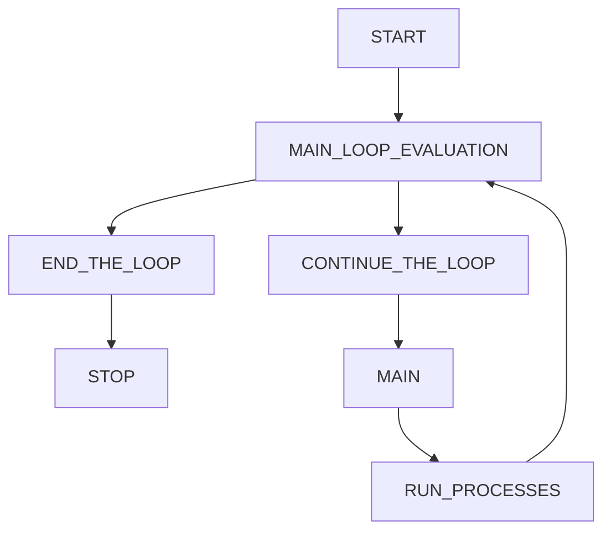
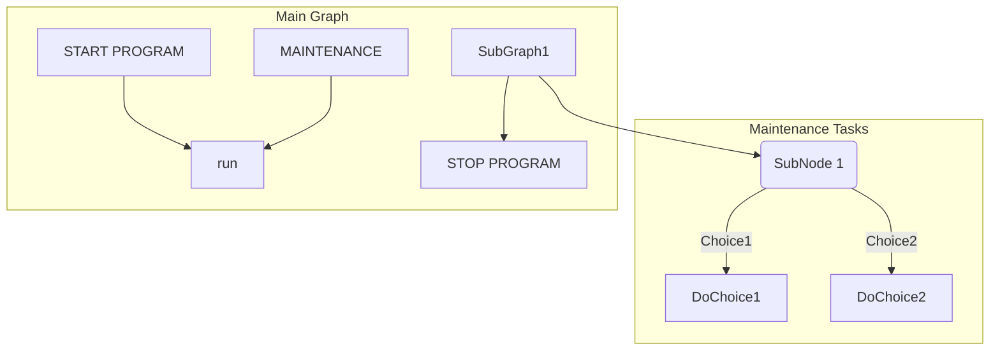

# GitLab Markdown Notes
Citations:
Lab, G. (n.d.). *Gitlab flavored markdown (GLFM).* GitLab. Retrieved October 15, 2022, from 
  https://docs.gitlab.com/ee/user/markdown.html 

---
## HTML Equivelent of an UNORDERED `<UL><LI></LI></UL>` is <kbd>-</kbd> or <kbd>*</kbd> or <kbd>+</kbd>
- <kbd>-</kbd>Cat1
- <kbd>-</kbd>Cat2
+ <kbd>+</kbd>Dog1
+ <kbd>+</kbd>Dog2
* <kbd>*</kbd>Turtle1
* <kbd>*</kbd>Turtle2
---
## Ordered Lists are enumerated with a number, period, space.
1. `1.`Text
2. Text
---

## Task Lists

1. [X] Unordered List
1. [~] Add Extra Features free of charge to customer.
1. [ ] Graphing
   1. [x] Simple Mermaid Chart
   1. [ ] Advanced Mermaid Chart
   1. [~] Usable Enterprise Relational Diagrams

---
## SIMPLE MERMAID FLOWCHART

## ADVANCED MERMAID FLOWCHART


```mermaid
graph TB

  subgraph "Shell Program"
  userinput[Get Program Arguments] --> SubGraph1[Jump to Compression Class]
  SubGraph1 --> printReport[Print Log Report]
  printReport --> endprg[Exit Program]

  SubGraph1 --> SubGraph1Flow
  subgraph "Compress Data"
  SubGraph1Flow(CHUNKED?)
  SubGraph1Flow -- Chunked Data Buffer -- DoCompressionMethod1 --> return[Return Data Structure]
  SubGraph1Flow -- Complete Data Buffer -- DoCompressionMethod2 --> return[Return Data Structure]
  end

end
```
---
