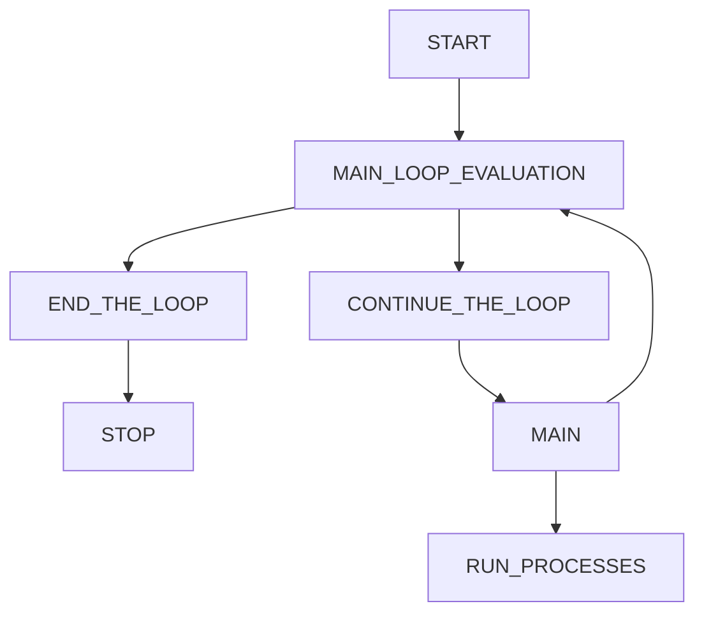
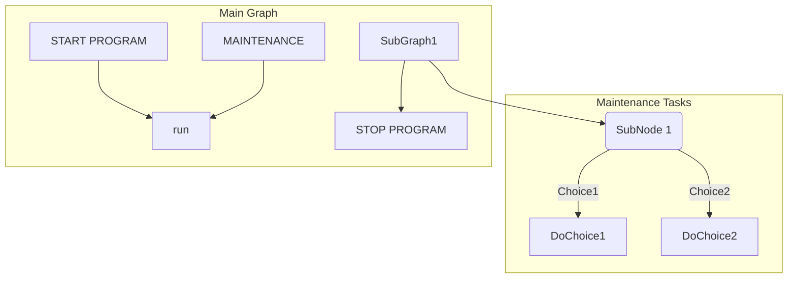
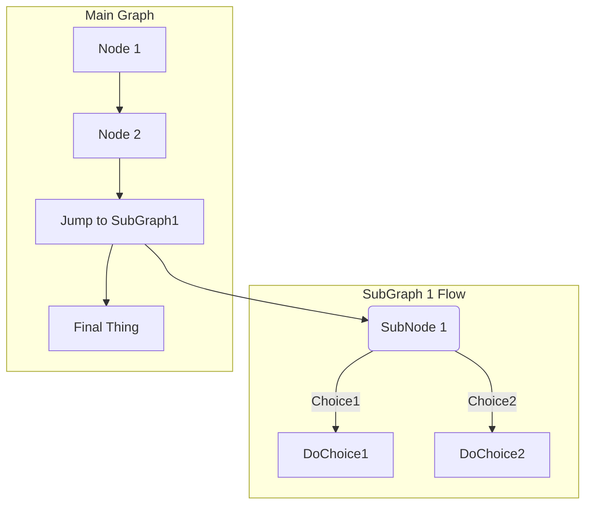

GitLab Markdown Notes

1. [x] Unordered List
1. [~] Add Extra Features free of charge to customer.
1. [ ] Graphing
   1. [x] Simple Mermaid Chart
   1. [ ] Advanced Mermaid Chart
   1. [~] Usable Enterprise Relational Diagrams

>>>
* block
- quotes
>>>
HTML Equivelent of an UNORDERED LIST is Hyphen.

<UL>
	<LI>Cat</LI>
	<LI>Dog</LI>
	<LI>Turtle</LI>
</UL>

- Cat
- Dog
- Turtle

SIMPLE MERMAID FLOWCHART

ADVANCED MERMAID FLOWCHART

