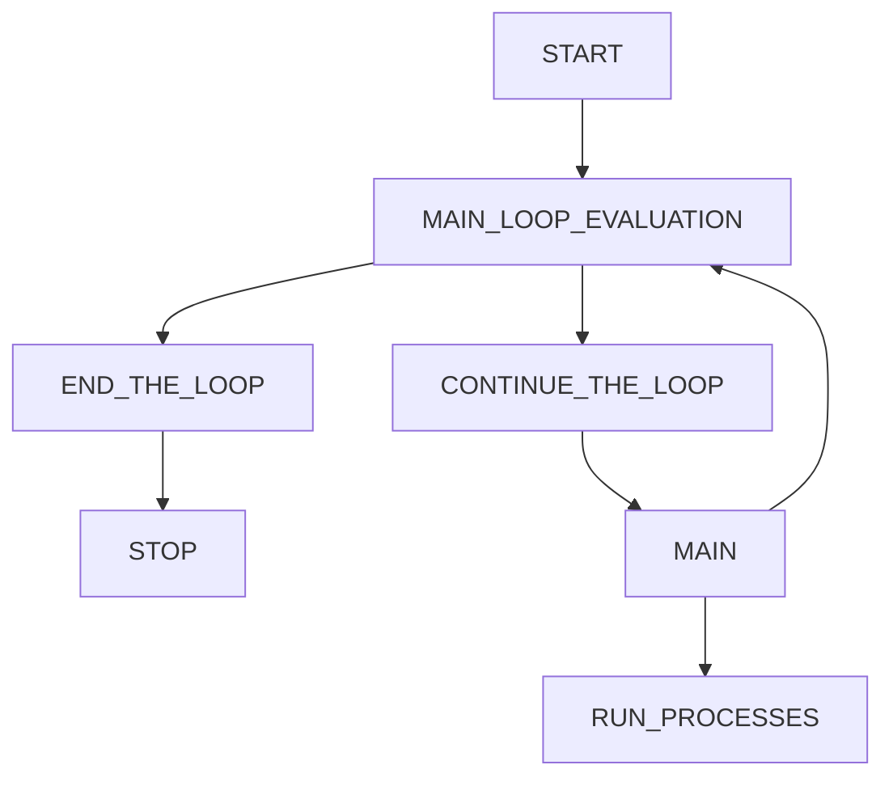

HTML Equivelent of an UNORDERED LIST is Hyphen.

<UL>
	<LI>Cat</LI>
	<LI>Dog</LI>
	<LI>Turtle</LI>
</UL>

- Cat
- Dog
- Turtle

EXAMPLE MERMAID FLOWCHART

```mermaid
graph TD;
  A-->B;
  A-->C;
  B-->D;
  C-->D;
```

```mermaid
graph TD;
  START-->MAIN_LOOP_EVALUATION;
  MAIN_LOOP_EVALUATION-->CONTINUE_THE_LOOP;
  MAIN_LOOP_EVALUATION-->END_THE_LOOP; 
  END_THE_LOOP-->STOP;
  CONTINUE_THE_LOOP-->MAIN;
  MAIN-->RUN_PROCESSES;
  MAIN-->MAIN_LOOP_EVALUATION;
```
